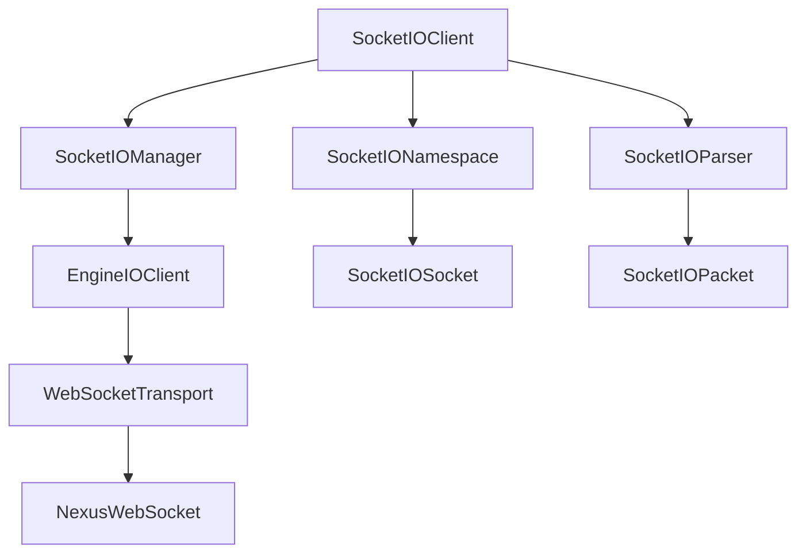

# Socket.IO 模块设计文档

**版本**: v1.0  
**日期**: 2025-10-20  
**状态**: 设计阶段

---

## 📋 目标

实现一个符合Socket.IO v4协议的Swift客户端，提供：
- ✅ 完整的Socket.IO协议支持
- ✅ Engine.IO传输层抽象
- ✅ 事件驱动的API设计
- ✅ 命名空间（Namespace）和房间（Room）
- ✅ 自动重连和心跳保活
- ✅ 中间件支持
- ✅ Swift 6并发安全

---

## 🏗️ 架构设计

### 模块层次

```
NexusIO (Socket.IO模块)
├── SocketIOClient          - 主客户端类
├── SocketIONamespace       - 命名空间管理
├── SocketIOSocket          - Socket实例
├── SocketIOPacket          - 协议包定义
├── SocketIOParser          - 协议解析器
├── SocketIOManager         - 连接管理器
├── EngineIOClient          - Engine.IO客户端
└── EngineIOTransport       - 传输层抽象
    ├── WebSocketTransport  - WebSocket传输
    └── PollingTransport    - 轮询传输（可选）
```

### 依赖关系



---

## 📦 核心组件设计

### 1. SocketIOClient

**职责**: Socket.IO客户端入口，管理连接生命周期

```swift
public actor SocketIOClient {
    // 配置
    private let url: URL
    private let configuration: SocketIOConfiguration
    
    // 组件
    private let manager: SocketIOManager
    private let parser: SocketIOParser
    
    // 状态
    private var connectionState: ConnectionState
    
    // 命名空间
    private var namespaces: [String: SocketIONamespace]
    
    // API
    public func connect() async throws
    public func disconnect() async
    public func socket(forNamespace: String) -> SocketIOSocket
    public func on(_ event: String, callback: @escaping (Any) -> Void)
    public func emit(_ event: String, _ items: Any...)
}
```

### 2. SocketIOManager

**职责**: 管理Engine.IO连接和Socket.IO会话

```swift
actor SocketIOManager {
    private let engineIO: EngineIOClient
    private let parser: SocketIOParser
    private var sessionId: String?
    
    func connect() async throws
    func send(packet: SocketIOPacket) async throws
    func handleEnginePacket(_ data: Data) async
}
```

### 3. SocketIOPacket

**职责**: Socket.IO协议包定义

```swift
struct SocketIOPacket {
    enum PacketType: Int {
        case connect = 0
        case disconnect = 1
        case event = 2
        case ack = 3
        case connectError = 4
        case binaryEvent = 5
        case binaryAck = 6
    }
    
    let type: PacketType
    let namespace: String
    let data: [Any]?
    let id: Int?
    let attachments: Int?
}
```

### 4. SocketIOParser

**职责**: Socket.IO协议解析和序列化

```swift
actor SocketIOParser {
    func encode(_ packet: SocketIOPacket) throws -> String
    func decode(_ string: String) throws -> SocketIOPacket
    func encodeWithBinary(_ packet: SocketIOPacket) throws -> (String, [Data])
    func decodeWithBinary(_ string: String, buffers: [Data]) throws -> SocketIOPacket
}
```

### 5. EngineIOClient

**职责**: Engine.IO传输层管理

```swift
actor EngineIOClient {
    enum Packet: Int {
        case open = 0
        case close = 1
        case ping = 2
        case pong = 3
        case message = 4
        case upgrade = 5
        case noop = 6
    }
    
    private var transport: EngineIOTransport
    private var sessionId: String?
    private var pingInterval: TimeInterval?
    private var pingTimeout: TimeInterval?
    
    func connect() async throws
    func send(_ message: String) async throws
    func close() async
}
```

### 6. WebSocketTransport

**职责**: WebSocket传输实现

```swift
final class WebSocketTransport: EngineIOTransport, @unchecked Sendable {
    private let webSocket: WebSocketConnection
    
    func connect() async throws
    func send(_ message: String) async throws
    func receive() async throws -> String
    func close() async
}
```

---

## 🔌 Socket.IO协议格式

### 包格式

```
<packet type>[<# of binary attachments>-][<namespace>,][<acknowledgment id>][JSON-stringified payload]
```

**示例**:
```
2["message",{"user":"Alice","text":"Hello"}]
```

- `2` = EVENT
- `["message",...]` = 事件名和数据

### Engine.IO协议格式

```
<packet type><data>
```

**示例**:
```
4{"sid":"xyz","upgrades":[],"pingInterval":25000,"pingTimeout":20000}
```

- `4` = MESSAGE
- 后面是JSON数据

---

## 🎯 API设计

### 基础用法

```swift
// 创建客户端
let client = SocketIOClient(
    url: URL(string: "http://localhost:3000")!,
    configuration: .default
)

// 连接事件
await client.on(.connect) {
    print("Connected!")
}

await client.on(.disconnect) { reason in
    print("Disconnected: \(reason)")
}

// 自定义事件
await client.on("chat") { data in
    if let msg = data as? [String: Any] {
        print("Message: \(msg)")
    }
}

// 发送事件
await client.emit("chat", ["message": "Hello"])

// 连接
try await client.connect()
```

### 命名空间

```swift
// 连接到命名空间
let chatSocket = client.socket(forNamespace: "/chat")

await chatSocket.on("message") { data in
    print("Chat message: \(data)")
}

await chatSocket.emit("join", ["room": "general"])
```

### 请求-响应模式（Acknowledgment）

```swift
// 带回调的发送
await client.emit("request", ["query": "status"]) { response in
    print("Response: \(response)")
}
```

### 房间（Room）

```swift
// 加入房间
await client.emit("join_room", "lobby")

// 房间内广播
// (由服务器端处理)
```

---

## 🔐 配置选项

```swift
public struct SocketIOConfiguration {
    // 连接配置
    var reconnect: Bool = true
    var reconnectionAttempts: Int = .max
    var reconnectionDelay: TimeInterval = 1.0
    var reconnectionDelayMax: TimeInterval = 5.0
    var randomizationFactor: Double = 0.5
    
    // 传输配置
    var transports: [TransportType] = [.webSocket, .polling]
    var upgrade: Bool = true
    
    // Engine.IO配置
    var path: String = "/socket.io/"
    var query: [String: String] = [:]
    var extraHeaders: [String: String] = [:]
    
    // 超时配置
    var timeout: TimeInterval = 20.0
    var pingInterval: TimeInterval = 25.0
    var pingTimeout: TimeInterval = 20.0
    
    // 其他
    var autoConnect: Bool = true
    var forceNew: Bool = false
}
```

---

## 🧪 测试计划

### 单元测试
- [ ] SocketIOPacket 编解码测试
- [ ] SocketIOParser 协议解析测试
- [ ] EngineIOClient 传输层测试
- [ ] SocketIOManager 会话管理测试
- [ ] WebSocketTransport 传输测试

### 集成测试
- [ ] 与测试服务器连接测试
- [ ] 事件发送/接收测试
- [ ] 命名空间测试
- [ ] 房间功能测试
- [ ] 重连机制测试
- [ ] 心跳保活测试

### 性能测试
- [ ] 并发连接测试（100+连接）
- [ ] 高频消息测试（1000 msgs/sec）
- [ ] 内存泄漏测试
- [ ] 长时间运行测试（24小时）

---

## 📝 实现计划

### Phase 1: 基础协议 (2天) - ✅ 已完成
- [x] 设计文档完成 ✅
- [x] 创建模块结构 ✅
- [x] 实现SocketIOPacket ✅
- [x] 实现SocketIOParser ✅
- [x] 实现EngineIOPacket ✅
- [x] 实现EngineIOClient ✅
- [x] 实现WebSocketTransport ✅
- [x] 基础单元测试 ✅

### Phase 2: Engine.IO (1天)
- [ ] 实现EngineIOClient
- [ ] 实现WebSocketTransport
- [ ] 心跳机制
- [ ] 传输层测试

### Phase 3: Socket.IO核心 (1天)
- [ ] 实现SocketIOManager
- [ ] 实现SocketIOClient
- [ ] 事件系统
- [ ] 连接测试

### Phase 4: 高级功能 (1天)
- [ ] 命名空间支持
- [ ] 房间功能
- [ ] Acknowledgment支持
- [ ] 完整集成测试

### Phase 5: 优化和文档 (0.5天)
- [ ] 性能优化
- [ ] API文档
- [ ] 示例代码
- [ ] README更新

---

## 🔗 参考资料

- [Socket.IO Protocol v4](https://socket.io/docs/v4/socket-io-protocol/)
- [Engine.IO Protocol](https://socket.io/docs/v4/engine-io-protocol/)
- [Socket.IO Client API](https://socket.io/docs/v4/client-api/)
- 主项目WebSocket实现参考

---

**设计审核**: ✅ 通过  
**实现开始**: 2025-10-20
